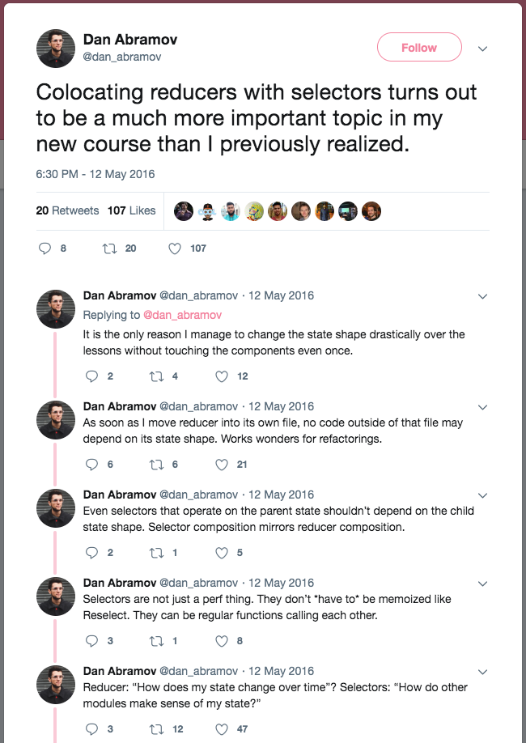

title: Reselect Presentation
author:
  name: Philip Kubiak
  url: https://github.com/koobeeyak
output: basic.html
controls: true

--
# **Selectors in Redux**
<br>
## A quick look  👀  into selectors and the Redux-Reselect library
## *Sema4 Front-End Guild Meeting* ⛩ *May 9, 2019*

--

### Why do we use Redux?

--

### Why do we use Redux?

- *Application has a global state (the Redux store)*
<br>


--

### Why do we use Redux?

- *Application has a global state (the Redux store)*
	- *Can influence the state of any component*
<br>


--

[//]: # (Don't end up passing too many props down into distant children)

### Why do we use Redux?

- *Application has a global state (the Redux store)*
<br>


- *Separate the logic that decides **what** we should render away from the logic that decides **how** we should render it*

--

<br><br>

```js
// app/containers/ThisViewsContainer.js

import { connect } from 'react-redux';
import ThisViewsComponent from '../components/ThisViewsComponent';

```

--

<br><br>

```js
// app/containers/ThisViewsContainer.js

import { connect } from 'react-redux';
import ThisViewsComponent from '../components/ThisViewsComponent';

const mapStateToProps // = ...?
```

--

<br><br>

```js
// app/containers/ThisViewsContainer.js

import { connect } from 'react-redux';
import ThisViewsComponent from '../components/ThisViewsComponent';

const mapStateToProps = state => ({ /* ... */ });
```

--

<br><br>

```js
// app/containers/ThisViewsContainer.js

import { connect } from 'react-redux';
import ThisViewsComponent from '../components/ThisViewsComponent';

const mapStateToProps = state => ({ /* ... */ });
const mapDispatchToProps // = ...?
```

--

[//]: # (What is state in this context? What is dispatch?)

<br><br>

```js
// app/containers/ThisViewsContainer.js

import { connect } from 'react-redux';
import ThisViewsComponent from '../components/ThisViewsComponent';

const mapStateToProps = state => ({ /* ... */ });
const mapDispatchToProps = dispatch => ({ /* ... */ });
```

--

<br><br>

```js
// app/containers/ThisViewsContainer.js

import { connect } from 'react-redux';
import ThisViewsComponent from '../components/ThisViewsComponent';

const mapStateToProps = state => ({ /* ... */ });
const mapDispatchToProps = dispatch => ({ /* ... */ });

const ThisViewsContainer = connect(
	mapStateToProps,
	mapDispatchToProps
)(ThisViewsComponent);
```

--


<br><br>

```js
// app/components/ThisViewsComponent.js

const ThisViewsComponent = ({ statePassedViaProps, dispatchPassedViaProps }) => (
	<div>{ /* ... */ }<div>
)

export ThisViewsComponent;

```

--

### Why do we use Redux?

- *Application has a global state (the Redux store)*
<br>


- *Separate the logic that decides **what** we should render away from the logic that decides **how** we should render it*

--

### Separation of State & State

- *Develop with a strict differentiation between components that render stuff*
    - *Call* `render()`
- *From components that provide data and conditions that determine rendering (can call them containers)*
	- *Pass* `{ ...props }`

--

### The "Selector" Ideology

If you develop with...

&nbsp;&nbsp;&nbsp;*Presentational & Container Components,*

&nbsp;&nbsp;&nbsp;*Smart & Dumb(ish?) Components,*

&nbsp;&nbsp;&nbsp;*Stateful & Pure Components,*

... you should develop with **selectors.**

--

[//]: # (Argue for whether this tweet is outdated? React Hooks released as of v. 16.8, Sema4 is on v. 16.2)

## 

--

## 

--

[//]: # (introduce the general ideas of selectors here, that they can be just JS methods that pass basic data points)

<br>

`const mapStateToProps = state => ` **`({ /* ... */ })`**

--

[//]: # (Make the note that you can just pass the entire state to mapStateToProps, and it COULD work)
[//]: # (That does take advantage of Redux's separation of state and state, but not the rest of what Redux has to offer)
[//]: # (We're going to be looking at breaking up that pass of the huge state via selectors)

```js
// app/containers/SomeContainer.js

const mapStateToProps = state => ({ state: ...state.MyBigAndImportantReducer })
```

--
<div> <pre>
	<code>
js
// app/containers/SomeContainer.js

const mapStateToProps = state => ({
	someData: selectSomeData(state.MyBigAndImportantReducer)
})
</pre>
</code>
</div>
--

[//]: # (A use case where more users might be loaded at any moment)

```js
// MyBigAndImportantReducer
{
	filters: { testResultsReleased: false, openedEmail: undefined },
	data: {
		fetchInProgress: true, errorMessage: undefined, successMessage: undefined,
		users: {
			0: { testResults: [{/* */}, {/* */}], name: 'Jared Guy', email: '...' },
			1: { testResults: [{/* */}, {/* */}], name: 'Emily Person', email: '...' }
		}
	}
}

```

--

```js
// app/containers/DisplayUsersContainer.js

const mapStateToProps = state => ({ state: ...state.MyBigAndImportantReducer })
```

--

[//]: # (Re-renders when user selects new filter or loads new users)
```js
// app/components/DisplayUsers.js

filterUsers(filters, users) {
	/* will return a list of users narrowed down by filters */
}

render() {
	return (
		<div>
			{...this.filterUsers(this.state.filters, this.state.data.users)}
		</div>
	);
}
```

--

[//]: # (Let's talk about how we can rate this, we can talk about basic, most common ways to rate with readability & necessity to edit it in the future quickly with future changes which we can't predict)
[//]: # (Can rate it more specific to following the ideas about Redux we set forth and agreed upon earlier)
[//]: # (But let's go ahead and put it on the Emoji scale, and talk about that)
[//]: # (If you don't want to end up passing too many props down into distant children, using Redux to get around this, leaves me to believe at the very least we can make some further improvements)

### Emoji Scale

--

### Emoji Scale

# 🤷‍♂️ / 🤷‍♀️

--

```js
// app/containers/DisplayUsersContainer.js

const mapStateToProps = state => ({
	filters: state.MyBigAndImportantReducer.filters,
	users: state.MyBigAndImportantReducer.data.users
})
```
<br>
```js
// app/components/DisplayUsers.js

filterUsers(filters, users) { /* will return a list of users by filter */ }

render() {
	return (<div>{...this.filterUsers(this.state.filters, this.state.users)}</div>);
}
```

--

[//]: # (I don't know how I feel about this, in fact I think I feel worse)

### Emoji Scale

# 😶

--

[//]: # (that's because we went back and tried to optimize here but we can't re-use those mapStateToProps calls)

### Emoji Scale

# 😣

--

[//]: # (our first look at some selectors which are simple, they can live right in the reducer file they will query from, or can always separate them out)

```js
// app/reducers/MyBigAndImportantReducer.js

export const selectDisplayFilters = state => state.filters;
export const selectUsers = state => state.data.users;
```

<br>

```js
// app/containers/DisplayUsersContainer.js

import { selectUsers, selectDisplayFilters } from '../reducers/MyBigAndImportantReducer';

const mapStateToProps = state => ({
	filters: selectDisplayFilters(state.MyBigAndImportantReducer),
	users: selectUsers(state.MyBigAndImportantReducer)
})
```

[//]: # (and the DisplayUsersComponent.js doesn't need to change)

--

[//]: # (I hope that it has piqued your interest at least)

### Emoji Scale

# 🤔

